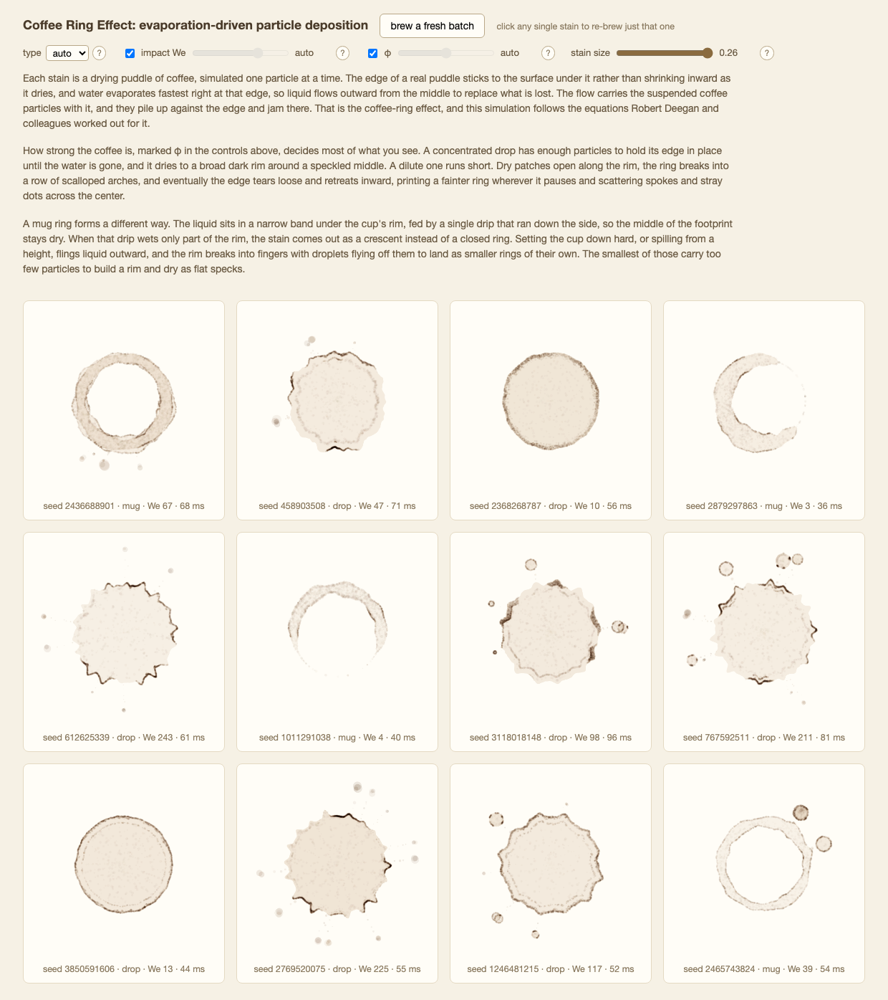

# coffee-ring-effect

Procedural coffee stains from a particle simulation of the coffee-ring physics (Deegan et al.), for use as texture on a page. A stain is generated once, in 40 to 120 ms, and painted as often as you like after that. Every stain is a pure function of its seed. No dependencies, no build step: import the module by path.



## Use

```js
import { createStain, paintStains } from './src/coffee-stains.js';

const mug = createStain({ type: 'mug', seed: 42, phi: 0.008, particles: 5000 });
const droplet = createStain({ type: 'drop', seed: 7, particles: 400, splashEnergy: 0 });

paintStains(ctx, [
  { stain: mug, x: 420, y: 260, radius: 180, opacity: 0.55, rotation: 0.1 },
  { stain: droplet, x: 130, y: 90, radius: 24, opacity: 0.4 },
]);
```

`createStain` runs the simulation and returns plain serializable data in units of the stain's own radius — cache it, ship it as JSON, paint it at any size. `paintStains` places it: array order, one save/restore per placement, `opacity` on `globalAlpha`, multiply blend unless you pass `{ composite }`.

Knobs: `type` ('drop' or 'mug'), `phi` (concentration — low gives sparse spoked interiors, high gives broad rims), `splashEnergy` (Weber-number stand-in; high values finger and splatter), `particles` (resolution, not ink). A droplet is not a third type: it is a small `'drop'` with few particles and no splash. See the module header for the rest.

Two ways to get pixels, with opposite bargains:

| | Owns the canvas? | For |
|---|---|---|
| `paintStains(ctx, scene)` | No — never clears, resizes, or leaves state behind. Whatever is underneath stays and blends. | Compositing stains onto a page you already drew |
| `generateStainCanvas({ size, seed })` | Yes — it creates (or takes) a canvas, sizes it, and hands it back | One stain, one image: `el.style.backgroundImage = url(canvas.toDataURL())` |

```bash
node --test                      # run the suite
python3 -m http.server 8000      # then open http://localhost:8000/demo/
```

`demo/texture.html` paints stains over patterned page content; `demo/index.html` is a grid of six with live physics knobs and a dark-field view, click any stain to re-brew it; `demo/animate.html` dries one in real time.

## The physics

A drying drop pins its contact line. Evaporation is strongest at the thin edge, so an outward capillary flow feeds the rim and carries suspended particles there, where they jam. That is the dark ring. Each particle is advected through Deegan's closed-form depth-averaged velocity field; there is no fluid solver.

```text
v(ρ,t) = [(1−ρ²)^(−λ) − (1−ρ²)] / (4ρ(1−t)),  λ = 1/2
```

One concentration knob, the solid volume fraction φ, drives the morphology, following Deegan, *Phys. Rev. E* **61**, 475 (2000):

- **Ring growth.** Ring width and height integrate the paper's Appendix ODEs per pinned epoch, so concentrated drops build broad rims and dilute drops thin ones.
- **Depinning.** At the measured onset time (t_d ∝ φ^0.26) dry holes nucleate on the ring's inner edge, grow, and arrest into arch scallops. When their union spans enough of the circumference the liquid tears free, retracts, and re-pins: nested inner rings.
- **Interiors.** Dilute drops never re-pin. The receding front settles the remaining particles into stick-slip arcs, cusp-emitted radial spokes, and scattered center dots, chosen per particle from the live remaining load.
- **Mug rings.** Liquid wicks from a single drip along the channel between cup rim and surface. A short reach dries as a crescent with a thick lobe and sharp tips; a long reach closes into a full ring. Overlapping placements share the drip.
- **Splashes.** Energetic drops finger into stars (finger count scales as √We) and eject satellites along the fingers. Fine ejecta flies fast but is drag-arrested into a close-in speck halo; droplets too dilute to self-pin dry as ringless dots.
- **Partial rings.** Azimuthal pinning noise: weakly pinned arcs recede and slosh their mass onto neighboring arcs, leaving C-shaped gaps.
- **Irregular outlines.** The contact line is a closed noisy contour, 2D simplex fBm sampled along a circle in noise space, so the contour closes with no seam.

The sim returns per-epoch `events` (depin onsets, hole geometry, ring radii) alongside the deposits; ring radii come from events, never from deposit statistics.

## Layout

| Path | What |
|---|---|
| `src/coffee-stains.js` | the public API: `createStain`, `paintStains` |
| `src/stain.js` | composition and impact-energy model, deposits to splats and washes |
| `src/physics.js` | velocity field, ring-growth ODE, hole depinning, interior settlement, crescent supply |
| `src/contour.js` | noisy closed contact line, optional splash fingers |
| `src/noise.js` | 2D simplex noise and fBm |
| `src/rng.js` | mulberry32 plus gaussian/uniform samplers |
| `src/render.js` | the canvas client: paints a stain, or generates one on its own canvas |
| `src/animate.js` | the drying animation |

See `docs/research-notes.md` for the research this design came from, including why live SVG `feTurbulence` filters were rejected.
